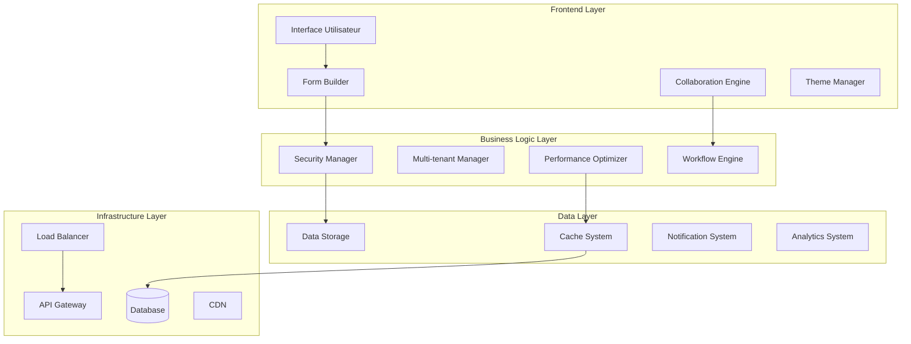
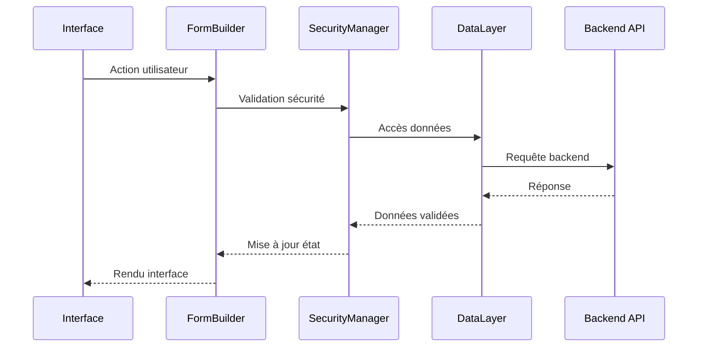

# 🏗️ Vue d'Ensemble de l'Architecture - FormEase v4.0

## 🎯 Philosophie Architecturale

FormEase suit une **architecture modulaire enterprise-grade** conçue pour la scalabilité, la maintenabilité et la performance. L'architecture adopte les principes de **Clean Architecture** et **Domain-Driven Design**.

## 📊 Architecture Globale



## 🏢 Architecture en Couches

### 1️⃣ Presentation Layer (Frontend)

**Responsabilités :**
- Interface utilisateur interactive
- Gestion des événements
- Rendu des composants
- Communication avec les services

**Composants Principaux :**

```javascript
// Structure modulaire frontend
frontend/
├── index.html                 // Point d'entrée principal
├── css/
│   ├── main.css              // Styles principaux
│   ├── themes/               // Thèmes personnalisables
│   └── components/           // Styles des composants
├── js/
│   ├── core/                 // Modules principaux
│   │   ├── FormBuilder.js    // Constructeur de formulaires
│   │   ├── ComponentManager.js // Gestionnaire de composants
│   │   └── EventSystem.js    // Système d'événements
│   ├── security/             // Modules de sécurité
│   │   ├── SecurityManager.js
│   │   ├── AuthManager.js
│   │   └── ValidationEngine.js
│   ├── multitenant/          // Architecture multi-tenant
│   │   ├── TenantManager.js
│   │   └── ResourceManager.js
│   ├── performance/          // Optimisation performances
│   │   ├── PerformanceOptimizer.js
│   │   └── CacheSystem.js
│   └── collaboration/        // Collaboration temps réel
│       ├── CollaborationEngine.js
│       └── NotificationRouter.js
```

### 2️⃣ Business Logic Layer

**Responsabilités :**
- Logique métier
- Règles de validation
- Orchestration des services
- Gestion des workflows

**Modules Principaux :**

#### 🔒 Security Module
```javascript
class SecurityManager {
    // Authentification et autorisation
    // Protection CSRF/XSS
    // Chiffrement des données
    // Audit de sécurité
}
```

#### 🏢 Multi-tenant Module
```javascript
class TenantManager {
    // Isolation des données
    // Gestion des ressources
    // Configuration par tenant
    // Facturation et quotas
}
```

#### ⚡ Performance Module
```javascript
class PerformanceOptimizer {
    // Optimisation automatique
    // Gestion du cache
    // Monitoring des performances
    // Auto-scaling
}
```

#### 🤝 Collaboration Module
```javascript
class CollaborationEngine {
    // Collaboration temps réel
    // Synchronisation des données
    // Gestion des conflits
    // Présence utilisateur
}
```

### 3️⃣ Data Access Layer

**Responsabilités :**
- Accès aux données
- Gestion du cache
- Synchronisation
- Persistance

**Composants :**

```javascript
// Abstraction de la couche données
class DataLayer {
    constructor() {
        this.storage = new StorageManager();
        this.cache = new CacheSystem();
        this.sync = new SyncManager();
    }
    
    // Interface unifiée pour l'accès aux données
    async get(key) { /* ... */ }
    async set(key, value) { /* ... */ }
    async delete(key) { /* ... */ }
    async query(filter) { /* ... */ }
}
```

### 4️⃣ Infrastructure Layer

**Responsabilités :**
- Déploiement
- Monitoring
- Load balancing
- CDN et cache

## 🔧 Patterns Architecturaux

### 🏗️ Module Pattern

```javascript
// Modularité avec encapsulation
const FormBuilderModule = (function() {
    // Variables privées
    let instance = null;
    
    // Interface publique
    return {
        getInstance() {
            if (!instance) {
                instance = new FormBuilder();
            }
            return instance;
        },
        
        createForm(config) {
            return this.getInstance().create(config);
        }
    };
})();
```

### 🔄 Observer Pattern

```javascript
// Système d'événements découplé
class EventSystem {
    constructor() {
        this.listeners = new Map();
    }
    
    on(event, callback) {
        if (!this.listeners.has(event)) {
            this.listeners.set(event, []);
        }
        this.listeners.get(event).push(callback);
    }
    
    emit(event, data) {
        if (this.listeners.has(event)) {
            this.listeners.get(event).forEach(callback => {
                callback(data);
            });
        }
    }
}
```

### 🏭 Factory Pattern

```javascript
// Création de composants dynamique
class ComponentFactory {
    static create(type, config) {
        switch(type) {
            case 'input':
                return new InputComponent(config);
            case 'select':
                return new SelectComponent(config);
            case 'textarea':
                return new TextAreaComponent(config);
            default:
                throw new Error(`Component type ${type} not supported`);
        }
    }
}
```

### 🎯 Strategy Pattern

```javascript
// Stratégies de validation interchangeables
class ValidationStrategy {
    static getValidator(type) {
        const strategies = {
            email: new EmailValidator(),
            phone: new PhoneValidator(),
            custom: new CustomValidator()
        };
        
        return strategies[type] || strategies.custom;
    }
}
```

## 🔄 Flow de Données

### 📥 Flux Unidirectionnel



### 🔄 Gestion d'État

```javascript
// État centralisé avec immutabilité
class StateManager {
    constructor() {
        this.state = Object.freeze({
            forms: new Map(),
            users: new Map(),
            ui: {
                loading: false,
                errors: [],
                notifications: []
            }
        });
        
        this.subscribers = [];
    }
    
    setState(newState) {
        const previousState = this.state;
        this.state = Object.freeze({
            ...previousState,
            ...newState
        });
        
        this.notifySubscribers(this.state, previousState);
    }
    
    subscribe(callback) {
        this.subscribers.push(callback);
        return () => {
            this.subscribers = this.subscribers.filter(sub => sub !== callback);
        };
    }
}
```

## 🔌 Interfaces et Contracts

### 📋 Interface IComponent

```typescript
interface IComponent {
    id: string;
    type: string;
    config: ComponentConfig;
    
    render(): HTMLElement;
    validate(): ValidationResult;
    getValue(): any;
    setValue(value: any): void;
    destroy(): void;
}
```

### 🔒 Interface ISecurityProvider

```typescript
interface ISecurityProvider {
    authenticate(credentials: Credentials): Promise<AuthResult>;
    authorize(user: User, resource: string): boolean;
    encrypt(data: string): string;
    decrypt(encryptedData: string): string;
    sanitize(input: string): string;
}
```

### 🏢 Interface ITenantProvider

```typescript
interface ITenantProvider {
    getTenant(id: string): Promise<Tenant>;
    createTenant(config: TenantConfig): Promise<Tenant>;
    updateTenant(id: string, updates: Partial<Tenant>): Promise<void>;
    deleteTenant(id: string): Promise<void>;
    getResources(tenantId: string): Promise<Resource[]>;
}
```

## 🎯 Principes de Design

### 1️⃣ Single Responsibility Principle
Chaque module a une responsabilité unique et bien définie.

### 2️⃣ Open/Closed Principle
Le système est ouvert à l'extension mais fermé à la modification.

### 3️⃣ Dependency Inversion
Les modules de haut niveau ne dépendent pas des modules de bas niveau.

### 4️⃣ Interface Segregation
Les interfaces sont spécifiques et ne forcent pas l'implémentation de méthodes inutiles.

## 🚀 Scalabilité

### 📈 Scaling Horizontal

```javascript
// Configuration pour le scaling
const ScalingConfig = {
    loadBalancer: {
        algorithm: 'round_robin',
        healthCheck: {
            interval: 30000,
            timeout: 5000,
            retries: 3
        }
    },
    
    autoScaling: {
        minInstances: 2,
        maxInstances: 10,
        targetCPU: 70,
        targetMemory: 80
    },
    
    caching: {
        levels: ['browser', 'cdn', 'application', 'database'],
        ttl: {
            static: 86400,    // 24h
            dynamic: 300,     // 5min
            user: 900         // 15min
        }
    }
};
```

### ⚡ Performance Optimizations

```javascript
// Optimisations intégrées
class PerformanceOptimizer {
    constructor() {
        this.lazyLoading = new LazyLoader();
        this.codesplitting = new CodeSplitter();
        this.bundleOptimizer = new BundleOptimizer();
        this.imageOptimizer = new ImageOptimizer();
    }
    
    optimize() {
        this.lazyLoading.enable();
        this.codesplitting.splitByRoute();
        this.bundleOptimizer.minify();
        this.imageOptimizer.compress();
    }
}
```

## 🔧 Configuration

### ⚙️ Configuration Centralisée

```javascript
// Configuration par environnement
const Config = {
    development: {
        api: {
            baseUrl: 'http://localhost:3000',
            timeout: 10000
        },
        logging: {
            level: 'debug',
            console: true
        },
        features: {
            hotReload: true,
            debugging: true
        }
    },
    
    production: {
        api: {
            baseUrl: 'https://api.formease.com',
            timeout: 5000
        },
        logging: {
            level: 'error',
            console: false
        },
        features: {
            hotReload: false,
            debugging: false
        }
    }
};
```

## 📚 Documentation Technique

### 🔍 Code Documentation

```javascript
/**
 * Gestionnaire principal de FormEase
 * 
 * @class FormBuilder
 * @description Constructeur de formulaires avec architecture modulaire
 * @version 4.0.0
 * @since 1.0.0
 * 
 * @example
 * const builder = new FormBuilder({
 *   container: '#form-container',
 *   theme: 'modern'
 * });
 * 
 * @param {FormBuilderConfig} config - Configuration du constructeur
 * @param {string} config.container - Sélecteur CSS du conteneur
 * @param {string} config.theme - Thème à utiliser
 * @param {boolean} config.collaboration - Activer la collaboration
 */
class FormBuilder {
    /**
     * Crée une nouvelle instance FormBuilder
     * @param {FormBuilderConfig} config
     */
    constructor(config) {
        // Implémentation...
    }
}
```

## 🏆 Bonnes Pratiques

### ✅ Code Quality

1. **ESLint + Prettier** : Formatage et qualité du code
2. **JSDoc** : Documentation inline complète
3. **Testing** : Tests unitaires et d'intégration
4. **TypeScript** : Typage optionnel pour de meilleurs IDE

### 🔒 Sécurité

1. **Input Validation** : Validation côté client et serveur
2. **HTTPS Only** : Chiffrement en transit
3. **CSP Headers** : Content Security Policy
4. **CSRF Protection** : Protection contre les attaques CSRF

### ⚡ Performance

1. **Lazy Loading** : Chargement paresseux des modules
2. **Code Splitting** : Division du code en chunks
3. **Caching Strategy** : Stratégie de cache multi-niveaux
4. **Minification** : Compression des assets

---

**FormEase v4.0** - *Enterprise Architecture*
Cette architecture garantit la scalabilité, la maintenabilité et les performances enterprise-grade.
